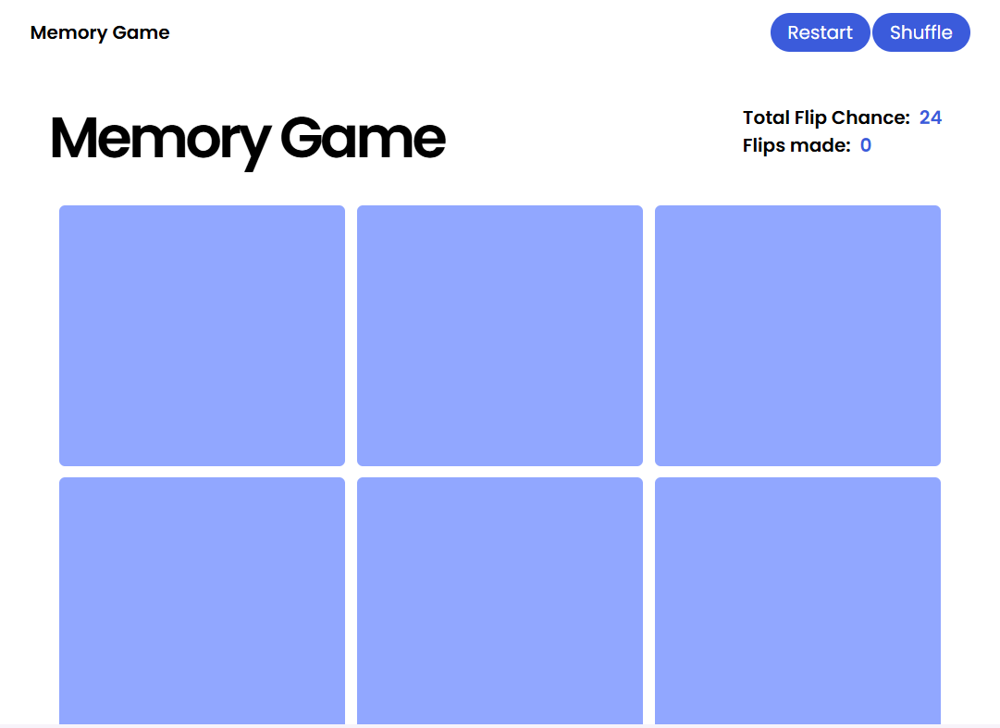
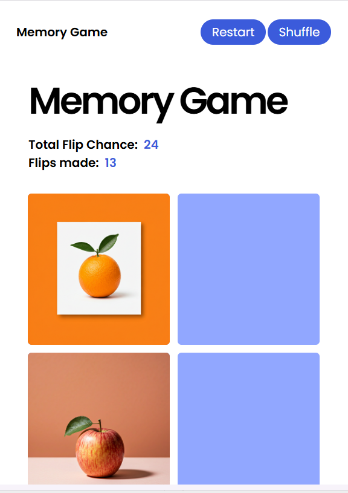

# 🧠 Memory Game

A simple memory card-matching game built using vanilla JavaScript, HTML, and CSS. Players flip cards to match pairs of fruit images within a limited number of chances.

## 🎮 Features

- Match fruit image pairs by flipping cards
- Shuffle functionality to restart the game with a new layout
- Flip count and remaining chances displayed
- Smooth flip logic with match detection
- Minimalistic and responsive UI

## 🛠️ Technologies Used

- HTML
- CSS
- JavaScript (ES6)

## 🚀 How to Play

1. Flip any two cards by clicking on them.
2. If the images match, they stay revealed.
3. If not, they flip back after a short delay.
4. You have a limited number of chances (24 by default) to match all the pairs. If you matched all the card within 24 chances you Win.Greater than 24 You lose.
5. Press the **Restart** button to restart the game.
6. Press the **Shuffle** button to Shuffle the Cards.

 🚀 Live Demo
🔗 [Click here to play the Memory Game](https://brain-memorygame.netlify.app/)

### 💻 Desktop View
Full-screen experience with grid layout and game interactions.

### 📲 Tablet View
Optimized layout with medium-size screen responsiveness.

### 📱 Mobile View
Responsive layout of the memory game on a mobile screen.

---

## 🙌 Credits

Developed with ❤️ by [Ramana S](https://github.com/CodeRamana)
